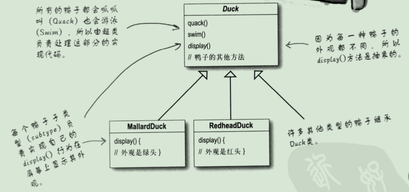
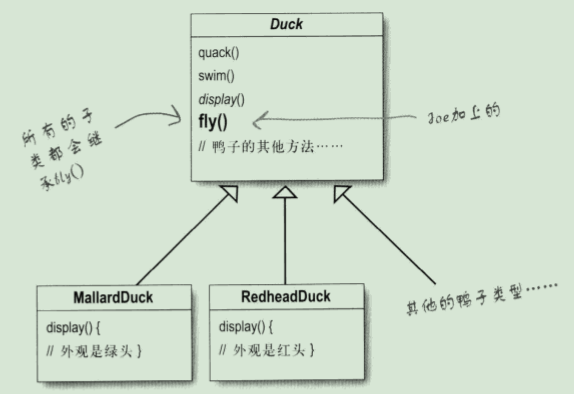
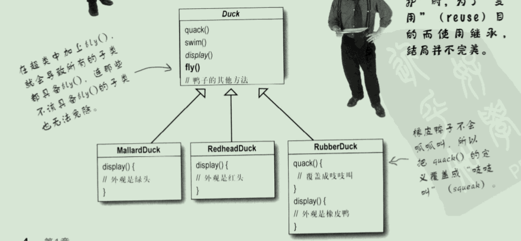
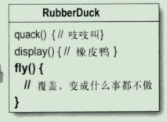
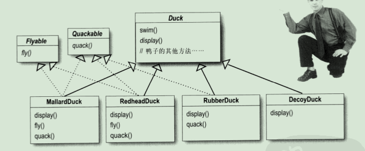
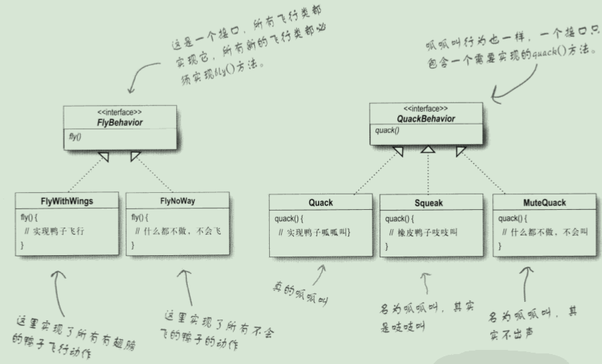

[TOC]

# 策略模式 strategy

## 1-定义

策略模式：定义了算法族，分别封装起来，让它们之间可以互相替换，此模式让算法的变化独立于使用算法的客户。

## 2-演进

### 1-通过继承

需求：所有鸭子都会叫、游泳

方案：创建 Duck 父类，其他子类继承 Duck 父类



需求：让鸭子飞起来

方案 ：Duck 父类添加 fly() 方法

引发问题：一些不会飞的鸭子也具有飞行能力



需求：有的鸭子不具备飞行能力

方案：重写子类中的 quack() 方法 和 fly() 方法





引发问题：如果以后加诱饵鸭（DecoyDuck）、橡皮鸭，子类需要方法覆盖，代码在子类中重复，牵一发动全身，造成其他鸭子不想要的改变

诱饵鸭：木头假鸭，不会飞也不会叫

橡皮鸭：不会飞，会叫

### 2-通过接口

需求：通过接口定义飞和叫

方案：提供 Flyable 接口，Quackable 接口，子类继承 Duck 父类，实现 Flyable 、Quackable  接口

引发问题：代码无法重用，会飞的鸭子，飞行的动作还有多种变化



### 3-通过接口以及对应的实现类

需求：可复用

方案：定义接口及接口实现，鸭子子类引用

优点：

* 这样的设计，可以让飞行和呱呱叫的动作被其他的对象复用，因为这些行为已经与鸭子类无关了
* 新增一些行为，不会影响到既有的行为类，也不会影响“使用”到飞行行为的鸭子类



## 3-实现

可以轻易的扩充和改变，甚至在运行时也可以改变其行为

Duck 抽象类

```java
public abstract class Duck {
	FlyBehavior flyBehavior;
	QuackBehavior quackBehavior;

	public Duck() {
	}

	public void setFlyBehavior(FlyBehavior fb) {
		flyBehavior = fb;
	}

	public void setQuackBehavior(QuackBehavior qb) {
		quackBehavior = qb;
	}

	abstract void display();

	public void performFly() {
		flyBehavior.fly();
	}

	public void performQuack() {
		quackBehavior.quack();
	}

	public void swim() {
		System.out.println("All ducks float, even decoys!");
	}
}
```

Duck 子类 DecoyDuck

```java
public class DecoyDuck extends Duck {
	public DecoyDuck() {
		setFlyBehavior(new FlyNoWay());
		setQuackBehavior(new MuteQuack());
	}
	public void display() {
		System.out.println("I'm a duck Decoy");
	}
}
```

Duck 子类 MallardDuck

```java
public class MallardDuck extends Duck {

	public MallardDuck() {

		quackBehavior = new Quack();
		flyBehavior = new FlyWithWings();

	}

	public void display() {
		System.out.println("I'm a real Mallard duck");
	}
}
```

Duck 子类 ModelDuck

```java
public class ModelDuck extends Duck {
	public ModelDuck() {
		flyBehavior = new FlyNoWay();
		quackBehavior = new Quack();
	}

	public void display() {
		System.out.println("I'm a model duck");
	}
}
```

Duck 子类 RubberDuck

```java
public class RubberDuck extends Duck {
 
	public RubberDuck() {
		flyBehavior = new FlyNoWay();
		//quackBehavior = new Squeak();
		quackBehavior = () -> System.out.println("Squeak");
	}
	
	public RubberDuck(FlyBehavior flyBehavior, QuackBehavior quackBehavior) {
		this.flyBehavior = flyBehavior;
		this.quackBehavior = quackBehavior; 
	}
 
	public void display() {
		System.out.println("I'm a rubber duckie");
	}
}
```

FlyBehavior 接口

```java
public interface FlyBehavior {
	void fly();
}
```
FlyBehavior 接口实现 FlyNoWay

```java
public class FlyNoWay implements FlyBehavior {
	public void fly() {
		System.out.println("I can't fly");
	}
}
```
FlyBehavior 接口实现 FlyRocketPowered

```java
public class FlyRocketPowered implements FlyBehavior {
	public void fly() {
		System.out.println("I'm flying with a rocket");
	}
}
```

FlyBehavior 接口实现 FlyWithWings

```java
public class FlyWithWings implements FlyBehavior {
	public void fly() {
		System.out.println("I'm flying!!");
	}
}
```

QuackBehavior 接口

```java
public interface QuackBehavior {
	void quack();
}
```

QuackBehavior 接口实现类 Quack

```java
public class Quack implements QuackBehavior {
	public void quack() {
		System.out.println("Quack");
	}
}
```

QuackBehavior 接口实现类 MuteQuack

```java
public class MuteQuack implements QuackBehavior {
	public void quack() {
		System.out.println("<< Silence >>");
	}
}
```

测试类

可以动态改变叫和飞的方式

```java
public class MiniDuckSimulator {

    public static void main(String[] args) {

        MallardDuck mallard = new MallardDuck();
        FlyBehavior cantFly = () -> System.out.println("I can't fly");
        QuackBehavior squeak = () -> System.out.println("Squeak");
        RubberDuck rubberDuckie = new RubberDuck(cantFly, squeak);
        DecoyDuck decoy = new DecoyDuck();

        Duck model = new ModelDuck();

        mallard.performQuack();
        rubberDuckie.performQuack();
        decoy.performQuack();

        model.performFly();
        model.setFlyBehavior(new FlyRocketPowered());
        model.performFly();
    }
}
```

执行结果：

```
Quack
Squeak
<< Silence >>
I can't fly
I'm flying with a rocket

```

